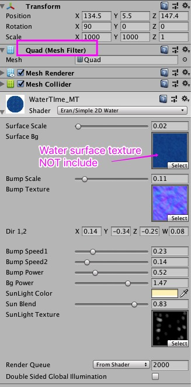
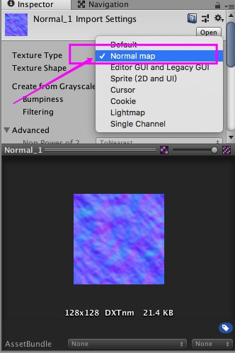
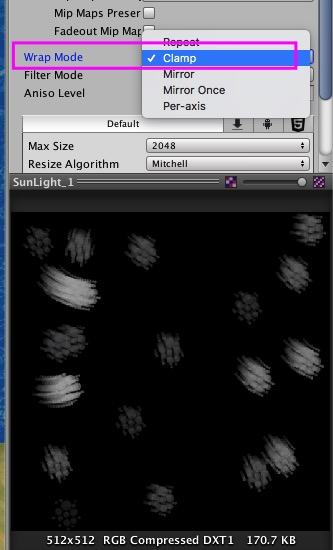

## Simple 2D Water Shader

[中文传送门](http://oldking.wang/7e726530-f07b-11e8-9356-679d14d5bec9/)

inspire by [则卷大明's Unity3D-移动平台简单水效果的实现](http://gad.qq.com/article/detail/25973) and [AoE2HD](https://store.steampowered.com/app/221380/Age_of_Empires_II_HD/)

### Preview

### Online Demo

[Link](https://tunied.github.io/Simple2DWater/)

### Config 

the water surface texture i used is come from [AoE2HD](https://store.steampowered.com/app/221380/Age_of_Empires_II_HD/),so i can't include in the project.

also make sure to import the noise texture as a `normal map` in your project.

and mark the sunlight texture warp mode to Clamp.

### More

if you curiousness on how i made this shader,please check more info on my [Blog](http://oldking.wang/7e726530-f07b-11e8-9356-679d14d5bec9/)

